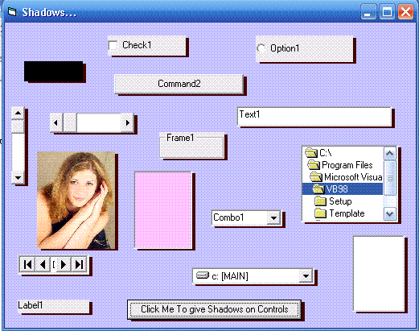



## VB Intrinsic Controls Shadow

### Description

This is for all beginners out there. No API's involve. This will give your vb controls a shadow. Codes are straight forward.Comments are welcome. Have a nice day !
 
### More Info
 

             |
---                |---
**Submitted On**   |2005-12-13 06:00:04
**By**             |[Mark Anthony Dinglasa](https://github.com/Planet-Source-Code/PSCIndex/blob/master/ByAuthor/mark-anthony-dinglasa.md)
**Level**          |Beginner
**User Rating**    |4.6 (41 globes from 9 users)
**Compatibility**  |VB 6\.0
**Category**       |[Graphics](https://github.com/Planet-Source-Code/PSCIndex/blob/master/ByCategory/graphics__1-46.md)
**World**          |[Visual Basic](https://github.com/Planet-Source-Code/PSCIndex/blob/master/ByWorld/visual-basic.md)
**Archive File**   |[VB\_Intrins19562412132005\.zip](https://github.com/Planet-Source-Code/mark-anthony-dinglasa-vb-intrinsic-controls-shadow__1-63633/archive/master.zip)

